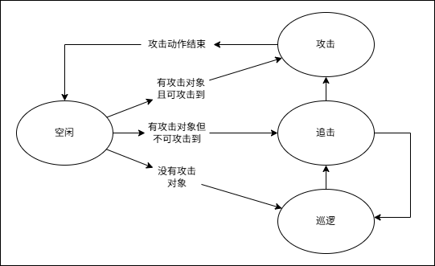

##### 基本介绍  
运行平台：Windows  
引擎版本：Unity6000.0.60f1  
代码路径：Assets/MyAssets  
游戏场景：Assets/Scenes/SampleScene.unity  
玩家人数：1人  
游戏类型：ARPG  
输入设备：键鼠  
演示视频：

https://private-user-images.githubusercontent.com/70421410/517791496-4aa29ee3-ddb5-4d4a-9783-cfb0da9e8f49.mp4

##### 动画/AI/战斗逻辑
由玩家输入或者敌人AI设置Trigger控制Animator  
玩家动画  .png)  
敌人动画  .png)  
敌人AI    
攻击动作状态切换时enable/disable武器碰撞箱，手动设定关键帧开启技能特效。

##### 技能/效果
技能1： 使用一个脚本生成的mesh做尾迹，加上两个粒子效果做打击效果   .png)  
技能2： 尾迹加武器周围粒子  .png)  

##### 图形
1. 阶梯光照  
风格化阶梯光照，但实际要有好的效果需要合适的模型，效果不明显。
.png)  
2. 描边(0.6ms)  
在几何着色器将三角形三个顶点分别沿相邻两条边垂直的切线方向移动，产生出六个新顶点。在稍往屏幕内侧移动。  
如果使用法线外扩对需要对模型顶点直接操作计算平均法线，我对于建模不熟，想避免破坏模型的可能性。不计算平均法线则缝隙太大。  
另外树叶、草模型使用的是Cull Off + Alpha clip构成，不适合用法线外扩。  
也做了后处理描边，但宽度不好控制+高光等颜色剧烈变化处可能出现不需要的描边，实际没有采用。  
计算时对相机距离加了一个bias，使描边的宽度随距离的变化速度略小于物体本身。没有完全使用固定宽度描边是因为远处物体会显得边过粗。  
.png)  
3. 泛光(0.25ms)  
使用5次mipmap强度过滤+降采样，再5次高斯模糊+超采样混合到原图上。  
.png)  
4. 深度高度雾(0.15ms)  
用深度图还原世界坐标的相对相机的距离和高度，计算附加的白色强度。xz平面上应用柏林噪声。使用exp(距离平方)做估计，没有使用ray marching。  
.png)  
5. 体积光(0.6ms 16采样点/0.9ms 32采样点)  
使用16个点ray marching采样shadermap上的数据计算散射光强度，每次采样到和上一个点遮挡情况不同时，再加两次二分估计变化边界。经过测试，采样点最终采用距离相机越近采样越密的分布，考虑有衰减下效果较好。  
再对体积光的采样结果以光源方向为中心，做数次考虑双边滤波的径向模糊。考虑体积光是一个边界敏感的数据，没有使用mipmap做模糊，但是直接指定模糊的步长是2的幂个像素。测试注意到该暗的地方亮了比该亮的地方暗了更明显异常，额外将模糊时高于原始点颜色的采样点权重乘一个小于1的系数。  
可以考虑在最后一次径向模糊中顺便做一个侧向的锐化，几乎没有开销0.02ms以下，可以使光柱边界更锐利，但少数情况也会放大问题。  
下图展示的是16个采样点的效果。  
.png)  

##### 优化
1. 少用透明物体。
2. 尽量使用相同的shader，甚至相同的Material，便于自动合批。
3. 尽量减少key word的变化便于合批。可以酌情关闭一些效果。我关闭了一个眼睛的emission效果，它夹在中间导致一个srp batch变成了三个。
4. 静态物体设为静态，便于静态合批，但是对LOD Group不生效。
5. 避免使用override shader，不支持srp batcher。会变成GPU instancing+static batch。
6. 考虑使用mesh baker等工具合并网格，这适用于一些复杂而聚集的模型。我的情况不适用，它导致剔除效果下降反而增加了开销。
7. 减少不必要的blit操作。
8. 尝试改变排序SortingCriteria。
9. 考虑是否可以使用half pixel。
10. 考虑能否使用小的低精度的少通道的texture，减少数据传输。
11. 尽量减少绘制区域，比如我关闭了天空盒上的体积光。
12. 尽量避免打断early z，考虑是否可以用alpha混合代替alpha裁剪，实在需要也要设置条件编译。
13. 是否可以将一些片元着色器的操作提前到顶点着色器。
14. 尽量减少ifelse，考虑使用数学乘法或条件编译替代。
15. 尽量用内置函数如max、saturate、dot而非手写逻辑，可能有硬件加速。
16. 考虑适当减少一些高消耗的效果或者忽略一些artifact。
17. 使用LOD shader，远处物体使用简单的着色模型。

测试环境：MX450

优化前(基本(3.3ms)+内置SSAO(2.0ms)+描边(0.9ms)+泛光(0.6ms)+雾(0.15ms)+体积光(3.8ms))：  
.png)  

优化后(基本(2.4ms)+内置SSAO(降低质量1.7ms)+描边(0.6ms)+泛光(0.25ms)+雾(无修改0.15ms)+体积光(0.6ms))：  
.png)  

